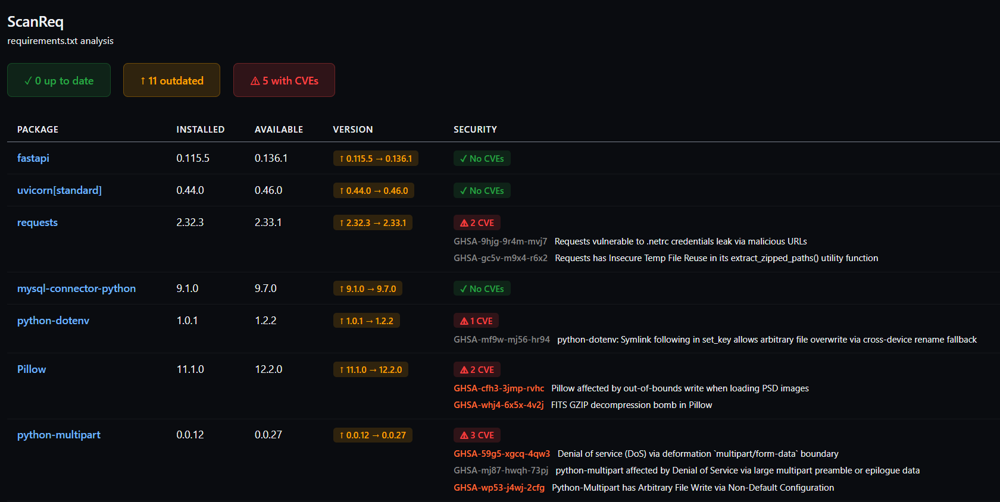
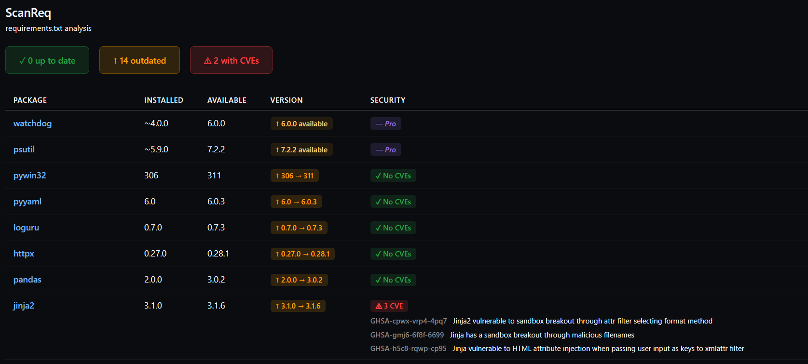
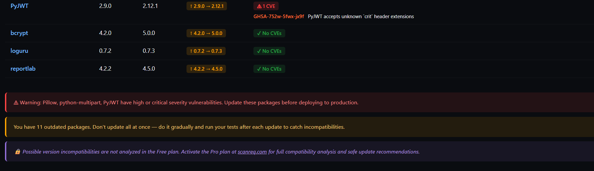

# ScanReq — Python Dependency Security Scanner

**ScanReq** scans your `requirements.txt` in real time, detects outdated packages via PyPI, and identifies CVE vulnerabilities via OSV.dev — all directly inside VS Code, with zero configuration.

---

## Features

- **Real-time PyPI check** — compares your pinned versions against the latest available
- **CVE detection** — queries OSV.dev for known vulnerabilities on exact versions (`==`)
- **Visual results panel** — color-coded table with version status and security badges
- **Smart insights** — contextual alerts: critical CVEs, bulk update warnings, actionable advice
- **Status bar badge** — red/orange/green indicator at a glance, click to open the panel
- **Auto-refresh** — panel updates automatically when `requirements.txt` is saved
- **English & Spanish** — UI language follows your VS Code language setting
- **Full pip operator support** — `==`, `>=`, `<=`, `>`, `<`, `!=`, `~=`, and ranges
- **Extras support** — handles `uvicorn[standard]==0.27.0` correctly
- **UTF-8 and UTF-16** encoding support for `requirements.txt`

---

## How it works

1. Open any Python project that contains a `requirements.txt`
2. ScanReq activates automatically and runs a scan in the background
3. The status bar shows the health of your dependencies at a glance
4. Click the badge or run **ScanReq: Analizar requirements.txt** from the Command Palette to open the full panel

---

## Extension Settings

| Setting | Default | Description |
|---|---|---|
| `scanreq.autoOpenPanel` | `false` | Open the results panel automatically on startup or when `requirements.txt` changes |
| `scanreq.showNotification` | `true` | Show a progress notification while the scan is running |

---

## Free vs Pro

| Feature | Free | Pro |
|---|---|---|
| PyPI version check | ✅ | ✅ |
| CVE detection (exact versions) | ✅ | ✅ |
| Smart insights | ✅ | ✅ |
| CVE detection for non-exact versions (`>=`, `~=`…) | ❌ | ✅ |
| Cross-version compatibility analysis | ❌ | ✅ |
| Safe update recommendations | ❌ | ✅ |

Upgrade at [scanreq.com](https://scanreq.com)

---

## Requirements

No external tools required. ScanReq uses the PyPI JSON API and OSV.dev API directly — no pip, no Python installation needed.

---

# ScanReq — Escáner de seguridad para dependencias Python

**ScanReq** analiza tu `requirements.txt` en tiempo real, detecta paquetes desactualizados consultando PyPI, e identifica vulnerabilidades CVE mediante OSV.dev — todo directamente en VS Code, sin configuración.

## Características

- **Consulta PyPI en tiempo real** — compara tus versiones fijadas con las últimas disponibles
- **Detección de CVEs** — consulta OSV.dev para versiones exactas (`==`)
- **Panel visual** — tabla con badges de estado de versión y seguridad
- **Mensajes inteligentes** — alertas contextuales: CVEs críticos, warnings de actualización masiva, consejos accionables
- **Badge en la barra de estado** — indicador rojo/naranja/verde, click para abrir el panel
- **Actualización automática** — el panel se refresca al guardar `requirements.txt`
- **Español e inglés** — el idioma sigue el ajuste de idioma de VS Code
- **Todos los operadores pip** — `==`, `>=`, `<=`, `>`, `<`, `!=`, `~=` y rangos
- **Soporte de extras** — maneja `uvicorn[standard]==0.27.0` correctamente
- **Codificación UTF-8 y UTF-16** para `requirements.txt`

## Configuración

| Ajuste | Por defecto | Descripción |
|---|---|---|
| `scanreq.autoOpenPanel` | `false` | Abre el panel automáticamente al iniciar o al detectar cambios |
| `scanreq.showNotification` | `true` | Muestra notificación de progreso durante el análisis |

## Free vs Pro

| Función | Free | Pro |
|---|---|---|
| Comprobación de versiones PyPI | ✅ | ✅ |
| Detección de CVEs (versiones exactas) | ✅ | ✅ |
| Mensajes inteligentes | ✅ | ✅ |
| CVEs para versiones no exactas (`>=`, `~=`…) | ❌ | ✅ |
| Análisis de compatibilidad entre versiones | ❌ | ✅ |
| Recomendaciones de actualización segura | ❌ | ✅ |

Activa el plan Pro en [scanreq.com](https://scanreq.com)
