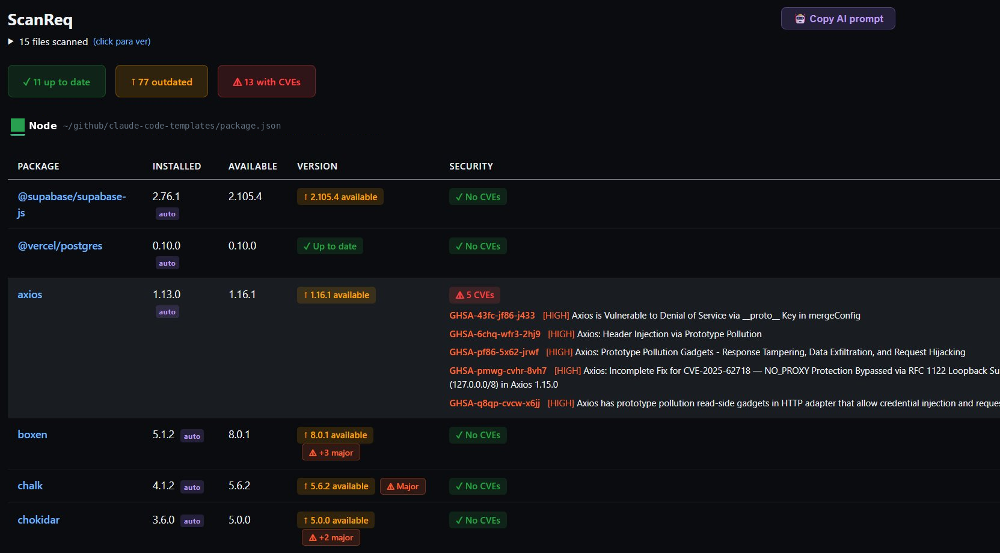
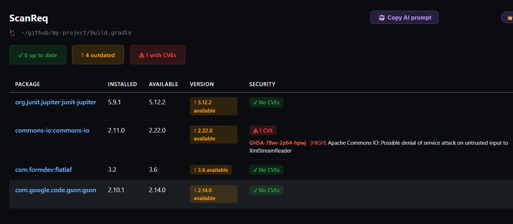
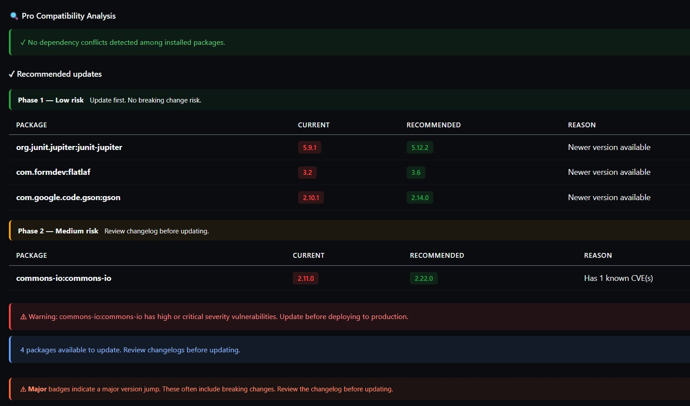

# ScanReq — Dependency Security Scanner for VS Code

Know what's vulnerable in your project before your users find out.

ScanReq scans every dependency file in your workspace, checks each package against its public registry, and flags CVEs from OSV.dev — **automatically, every time you save.**

No configuration. No CLI. No leaving the editor.

---

## Screenshots

> Scanned against real open-source projects from GitHub — not hand-picked examples.

**Node.js project — axios 1.13.0 with 5 HIGH CVEs detected, major version jumps flagged**

**Gradle project — commons-io CVE detected inline with GHSA ID and severity**

**Pro — Safe update plan with 3-phase migration table and compatibility analysis**

---

## The problem it solves

You open a cloned repo. It has 80 dependencies. Some are two years old. You have no idea which ones have known CVEs, which ones are 3 major versions behind, or which update will silently break your build.

`npm audit` / `pip-audit` / `cargo audit` help — but only for one ecosystem at a time, only from the terminal, and only when you remember to run them.

ScanReq runs in the background, covers 8 ecosystems at once, and surfaces the answer without you asking.

---

## Supported ecosystems

| | Ecosystem | File scanned | Registry |
|---|---|---|---|
| 🐍 | Python | `requirements.txt` | PyPI |
| 🟩 | Node.js | `package.json` | npm |
| 🦀 | Rust | `Cargo.toml` | crates.io |
| 🔵 | Go | `go.mod` | proxy.golang.org |
| 🐘 | PHP | `composer.json` | Packagist |
| 💎 | Ruby | `Gemfile` | RubyGems |
| ☕ | Java (Maven) | `pom.xml` | Maven Central |
| ☕ | Java (Gradle) | `build.gradle` / `build.gradle.kts` | Maven Central |

All 8 ecosystems work automatically — no per-language setup.

---

## How it works

1. Open any project. ScanReq detects your dependency files automatically.
2. A background scan runs — no spinner blocking your editor, no command to type.
3. The status bar badge updates: 🔴 critical issues / 🟠 outdated / 🟢 clean.
4. Click the badge (or `Ctrl+Shift+P → ScanReq: Scan dependencies`) to open the full results panel.
5. Every time you save a dependency file, the scan reruns.

Monorepo? ScanReq finds every dependency file across all subdirectories and shows them as separate sections in a single panel.

---

## Free plan

Everything below is free, forever, with no account required:

- ✅ Scans all 8 ecosystems in any workspace
- ✅ Compares your versions against the latest in each registry
- ✅ CVE detection via OSV.dev for packages pinned to exact versions (`==`, `=`)
- ✅ Color-coded results panel — one section per ecosystem
- ✅ Status bar badge (red / orange / green)
- ✅ Smart alerts at the bottom of the panel: critical CVE warnings, bulk update notices, actionable recommendations
- ✅ Auto-refresh on file save
- ✅ Monorepo support
- ✅ English and Spanish UI

**Limitation to know:** CVE detection on the free plan only works for exact version pins. If you write `>=1.2.0` or `^4.0.0`, ScanReq marks the package as `⚠ Unverified` — it cannot determine which version is actually installed without Pro.

---

## Pro plan — $19, one-time payment

Pro exists for one reason: most real projects don't pin every version exactly, and most real projects have transitive conflicts nobody notices until something breaks in production.

### What Pro adds

**CVE detection for non-exact versions**
When you write `>=`, `^`, `~=`, `~>` or a range, ScanReq Pro detects the version actually installed — via `pip`, `node_modules`, `composer.lock`, `Gemfile.lock`, or the manifest directly — and checks *that* version against OSV.dev. You get real CVE results, not a grey "Unverified" badge.

**Major version badge**
Any package that requires a major version jump to update is flagged with `⚠ Major` in the panel. At a glance you can separate "run the update" from "this needs a migration plan."

**Safe update table — 3 phases by migration risk**
Instead of a flat list of 40 packages to update, Pro gives you a prioritized plan:

| Phase | What it means | Action |
|---|---|---|
| 1 — Low risk | Patch / minor update, no CVEs | Apply directly |
| 2 — Medium risk | Has CVEs, or one major version jump | Review changelog first |
| 3 — High risk | Two or more major version jumps | Plan migration before updating |

Within each phase, packages with CVEs are listed first.

**Cross-version compatibility analysis**
Detects dependency conflicts — cases where package A requires `foo>=2.0` and package B requires `foo<2.0`. Works for Python, Node.js, Rust, PHP, and Ruby.

**Go transitive conflict analysis**
If Go is in your PATH, ScanReq runs `go mod graph` to surface indirect dependency conflicts your `go.mod` doesn't make obvious.

**Spring Boot BOM resolution (Maven & Gradle)**
Projects that inherit from `spring-boot-starter-parent` or use `spring-boot-dependencies` platform BOM get full version resolution — ScanReq downloads and parses the BOM so managed dependencies show real version data, not blanks.

**🤖 AI prompt export**
One click copies a structured prompt to your clipboard with the full scan results, ready to paste into Claude, Copilot, or Cursor. Ask your AI assistant to plan the migration, and it already has the context it needs.

### Free vs Pro at a glance

| Feature | Free | Pro |
|---|---|---|
| All 8 ecosystems | ✅ | ✅ |
| Real-time registry check | ✅ | ✅ |
| CVE detection (exact versions) | ✅ | ✅ |
| Visual results panel | ✅ | ✅ |
| Smart insights | ✅ | ✅ |
| Status bar badge | ✅ | ✅ |
| CVE detection for non-exact versions (`>=`, `^`, `~=`…) | ❌ | ✅ |
| Auto-detect installed version (pip / node_modules / lockfiles) | ❌ | ✅ |
| Cross-version compatibility analysis | ❌ | ✅ |
| Dependency conflict detection | ❌ | ✅ |
| Go transitive conflict analysis | ❌ | ✅ |
| Spring Boot BOM resolution (Maven / Gradle) | ❌ | ✅ |
| ⚠ Major version badge | ❌ | ✅ |
| Safe updates — 3-phase migration plan | ❌ | ✅ |
| 🤖 AI prompt export | ❌ | ✅ |

**$19 USD / €17 EUR — one-time payment. No subscription. Works on all your machines.**

→ [Get Pro at scanreq.com](https://scanreq.com/pricing)

---

## Activating Pro

1. Purchase at [scanreq.com/pricing](https://scanreq.com/pricing)
2. `Ctrl+Shift+P` → **ScanReq: Activar Plan Pro**
3. Enter your license token — Pro activates instantly

---

## Requirements

**Free plan:** no external tools required. ScanReq queries all registries directly over HTTPS.

**Pro plan** — most features need nothing extra, with a few exceptions:

| Ecosystem | What's needed for Pro |
|---|---|
| Python | `pip` in PATH (for installed version detection). If not found, a notice appears in the panel. |
| Node.js | `node_modules` present (run `npm install` first). ScanReq does not need `npm` in PATH. |
| Go | `go` in PATH for transitive conflict analysis via `go mod graph`. Safe update table works without it. |
| PHP | Nothing — uses `composer.lock` if present. |
| Ruby | Nothing — uses `Gemfile.lock` if present. |
| Rust | Nothing — `Cargo.toml` always contains explicit versions. |
| Java | Nothing — versions are read directly from `pom.xml` or `build.gradle`. |

---

## Settings

| Setting | Default | Description |
|---|---|---|
| `scanreq.autoOpenPanel` | `false` | Open the results panel automatically on startup or when a dependency file changes |
| `scanreq.showNotification` | `true` | Show a notification while the scan is running |

---

## Privacy

ScanReq sends no telemetry and collects no personal data.

Package names and versions are sent only to the relevant public registries (PyPI, npm, crates.io, proxy.golang.org, Packagist, RubyGems, Maven Central) and to OSV.dev for CVE lookups. No usage data is tracked.

Pro license tokens are validated against scanreq.com. The token is stored in VS Code's global state (plain text on disk — do not activate Pro on shared machines or CI environments).

---

## Release notes

See [CHANGELOG.md](CHANGELOG.md) for the full history.

**v2.5.1** — Security: `encodeURIComponent` added to Go module links; CVEs now sorted by severity before truncating (CRITICAL shown first); extractFixedVersion rewritten to recommend the minimum applicable fix for the installed version; OSV queries now time out after 10s; license token input masked.

---

[scanreq.com](https://scanreq.com) · [GitHub](https://github.com/JorgeCedilloAbarca/scanreq) · [VS Code Marketplace](https://marketplace.visualstudio.com/items?itemName=trustdev.scanreq)
